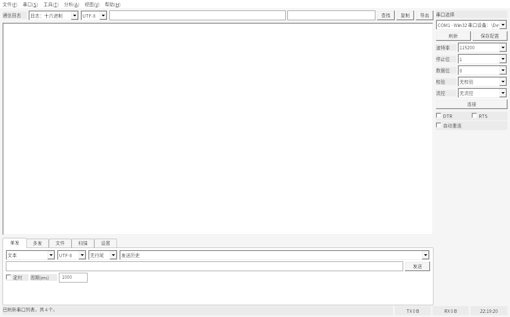

# 串口值匹配器

串口值匹配器是面向中文用户的 Windows 原生串口调试与数值匹配工具。当前主发布包是 Win32 native 版本，解压即可运行，不依赖 Qt 运行库、SQLite 插件或 .NET/C# 运行库。

- 项目名称：串口值匹配器 / SerialValueMatcher Native
- 作者：w
- 当前版本：v1.0.0
- 发布页：https://github.com/D1654/serial-value-matcher-native/releases/tag/v1.0.0
- 主程序：`svm-native-win32.exe`

## 下载安装

在 Release 页面下载：

```text
SerialValueMatcherNative-win32-native-x64.zip
```

解压后运行：

```text
svm-native-win32.exe
```

首次使用、串口连接、日志导出、发送、Modbus 扫描和报告流程见 [用户指南](docs/user-guide.md)。

v1.0.0 包信息：

- GitHub Actions Windows runner 构建；
- zip 和解压体积以 Release 附件中的 package summary 为准；
- 不包含 `Qt6*.dll`、`qsqlite.dll`、`sqldrivers` 或 .NET 运行库；
- SHA256 见 Release 附件中的 `.sha256.txt`。

## 界面预览



## 当前能力

串口调试：

- 串口刷新、连接、断开；
- 波特率、数据位、校验、停止位、流控、DTR、RTS；
- 自动重连和配置保存；
- 文本、HEX、十进制字节流、二进制字节流发送；
- 发送编码、日志编码、行尾、发送历史；
- 定时发送、10 组快捷发送、文件分块发送。

通信日志：

- TX/RX 区分显示；
- HEX、十进制、二进制、文本、HEX+文本显示；
- 日志时间开关、日志色系、筛选、搜索、复制、导出；
- 流式输出时可暂停跟随，便于回看历史数据；
- 可配置可见日志缓存，完整原始记录进入 native 存储。

分析工作流：

- FC03/FC04 Modbus RTU 基础扫描；
- 扫描进度显示和停止扫描；
- 按已知值生成候选寄存器；
- 规则验证；
- Markdown 报告导出。

## 使用流程

1. 选择串口和参数，点击连接。
2. 在“单发 / 多发 / 文件”标签页发送数据。
3. 在“通信日志”查看、筛选、搜索和导出收发记录。
4. 需要 Modbus 地址匹配时，进入“扫描”标签页，设置从站、功能码和地址范围。
5. 输入变量名、当前值、单位和误差，生成候选并验证规则。

## 当前边界

v1.0.0 已可作为轻量串口工具测试使用，但仍建议在真实设备上重点验证：

- USB 转串口芯片的端口描述和热插拔表现；
- DTR/RTS、硬件流控在具体设备上的效果；
- 高速连续收发和长时间运行；
- 大范围 Modbus 扫描的超时、取消和错误恢复；
- 候选分析结果是否符合现场业务语义。

Qt 版本源码仍保留在仓库中，用于历史基线和部分自动化测试；当前面向用户的轻量发布以 Win32 native 包为准。

## 构建与验证

Windows native CI：

```text
.github/workflows/windows-native-package.yml
```

本地 Linux/MinGW 交叉构建：

```bash
scripts/build-windows-native-mingw.sh
scripts/package-windows-native-mingw.sh
```

本地打包默认会执行 Wine 自测和 UI 性能硬门禁；Wine/UI 截图闭环见 `docs/windows-native-local-debug.md`。

## 文档

当前文档以 Win32 native 发布路线为准。优先阅读：

- `docs/user-guide.md`：当前用户指南入口。
- `docs/developer-guide.md`：当前开发者指南入口。
- `docs/architecture-win32-native.md`：Win32 native 架构入口。
- `docs/testing-validation.md`：测试、截图、PTY、包体审计和验证入口。
- `docs/release-artifacts.md`：Actions artifact 和发布产物入口。
- `docs/troubleshooting.md`：常见问题和排查入口。
- `docs/legacy-qt-notes.md`：Qt 历史路线说明。

过渡期参考文档：

- `docs/windows-deployment.md`
- `docs/windows-native-local-debug.md`
- `docs/windows-native-slimming.md`
- `docs/windows-native-parity.md`
- `docs/windows-native-ui-validation.md`
- `docs/windows-serial-validation.md`
- `docs/architecture.md`
